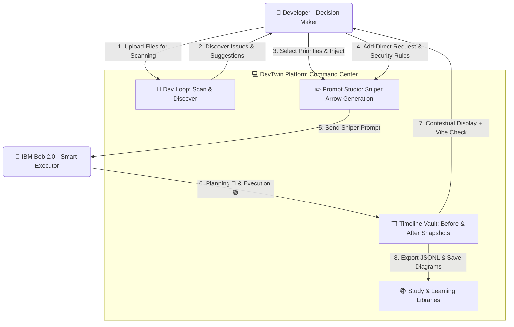
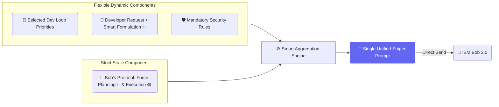
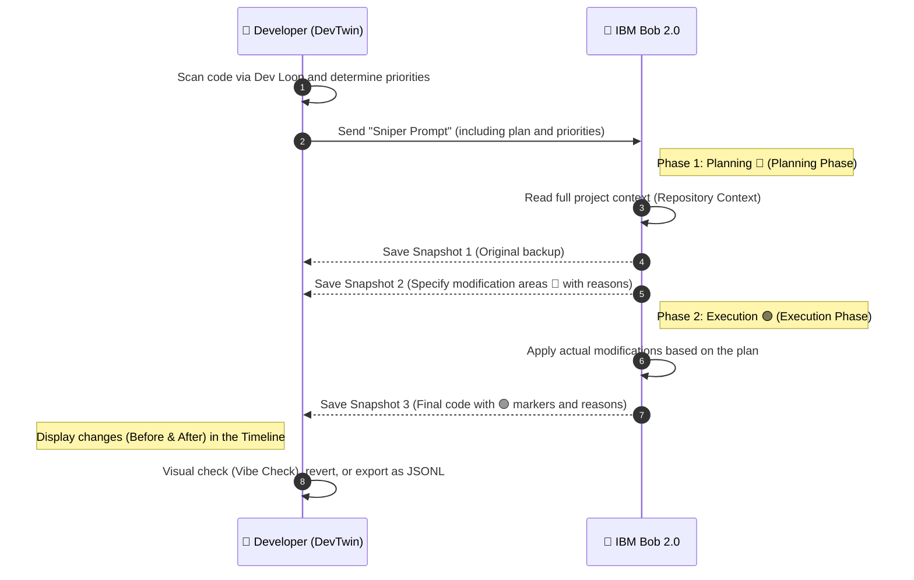

# 🧬 DevTwin: The Developer's Digital Twin

> **Stop coding blindfolded with AI.** DevTwin is the developer’s official proxy that turns chaotic AI generation into an audited, multi-dimensional engineering pipeline.

## 🌟 Overview

When developers rely on AI agents to mutate complex codebases, they often operate in the dark—struggling with untracked side effects, forgotten requirements, and fragile debugging.

**DevTwin** acts as a strict guardrail for **IBM Bob 2.0**. It enforces a secure 2-Phase Protocol (Planning 🔴 & Execution 🟢), ensuring that no AI touches your production code without clear intent, localized audit trails, and strict developer prioritization.

### 📊 Architectural Flow

This diagram illustrates how the cycle begins with the development loop (Dev Loop) for code scanning and prioritization, then integrates into the Prompt Studio, leading up to execution and saving time snapshots.

## 🏗️ The 3 Core Dimensions

DevTwin is built upon a robust 3-dimensional architecture to give engineers complete control:

### 1. Hybrid Prompting Engine (The "Sniper Prompt")

We broke the mold of standard prompting by introducing a Hybrid Orchestration Engine:

* **Static Protocol:** A hardcoded, strict contract forcing IBM Bob 2.0 to deeply audit repository context, generate snapshots, and document its rationale *before* editing.
* **Dynamic Layer:** A modular mix where developers input direct requests, toggle **Safety Rules** (e.g., "Never touch API keys"), and inject AI-discovered priorities.
* **Free Prompts Studio:** A standalone workspace to generate high-impact, dynamic prompts for any general-purpose AI model.

#### 🎯 Anatomy of the "Sniper Arrow"

### 2. Localized Visual Snapshot Vault

DevTwin eliminates visual fatigue through a local, chronological tracking system:

* **🔴 Planning vs. 🟢 Execution:** Visual markers highlight planned changes (Red) versus executed code (Green) with inline AI justifications directly above the affected lines.
* **Live Vibe Check:** An integrated sandbox UI (iframe) to instantly preview frontend modifications.
* **Instant Rollbacks:** Safely revert to any original code state with a single click.

#### 🔄 Code and Snapshot Lifecycle

### 3. Dev Loop & Continuous Learning

AI should discover issues, but the *engineer* dictates the roadmap:

* **Developer-Prioritized AI Review:** Automated scanning flags bugs, security flaws, and performance drops. The developer cherry-picks critical fixes to inject directly into the unified prompt.
* **Training Dataset Builder (JSONL):** Export chronological code snapshots directly into `.jsonl` files to study issues or fine-tune future AI models on authentic engineering lifecycles.
* **AI Analysis & Study Archives:** Generate and save architectural ASCII diagrams and deep-dive explanations for continuous team learning.

4. Package Marketplace:
A built-in decentralized marketplace within DevTwin that allows developers to browse, share, buy, and sell specialized prompt packages and custom snippets optimized for AI coding assistants like IBM Bob 2.0.
•	Custom Studio Integration: Developers can seamlessly import purchased packages into a dedicated section alongside system rules, tailoring their workspace to specific project needs with a single click.
•	Developer Economy & Monetization: Transforms DevTwin into a sustainable SaaS ecosystem by enabling developers to monetize their custom prompt engineering workflows while the platform operates on a commission-based model.
•	Community-Driven Growth: Leverages community expertise to bridge skill gaps, allowing junior developers to leverage enterprise-grade, expert-crafted prompt workflows instantly.

## 🤖 Built for IBM Bob 2.0

This project was specifically engineered for the **IBM Bob 2.0 Hackathon** (Sept 25–27, 2026).
DevTwin leverages Bob 2.0’s capability to operate with full repository context and parallel subagents. By feeding Bob our Hybrid Prompts, we force the AI to act as a structured engineering partner rather than a simple code generator.

We utilized IBM Bob 2.0 as the core intelligence engine for our dual-phase engineering protocol. Instead of direct, unstructured chatting, DevTwin acts as an orchestration layer. It generates highly structured, constraint-heavy prompts that force Bob to first output a "Planning Snapshot" (analyzing context and intent), followed by an "Execution Snapshot" (applying changes). Furthermore, Bob's analytical capabilities are integrated into DevTwin's "AI Analysis" panel to explain code evolution, and into the "Dev Loop Studio" to autonomously audit code files before generating the final prompt pipeline.
 

 
## 📜 License

This project is licensed under the **MIT License** - see the [LICENSE](LICENSE) file for details.
*Built with ❤️ for the IBM Bob 2.0 Hackathon.*